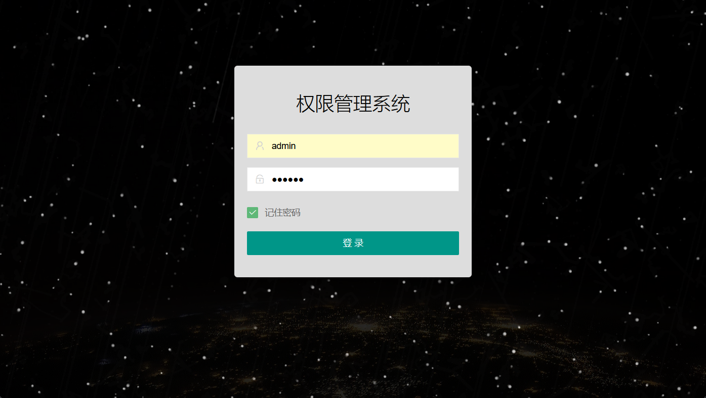
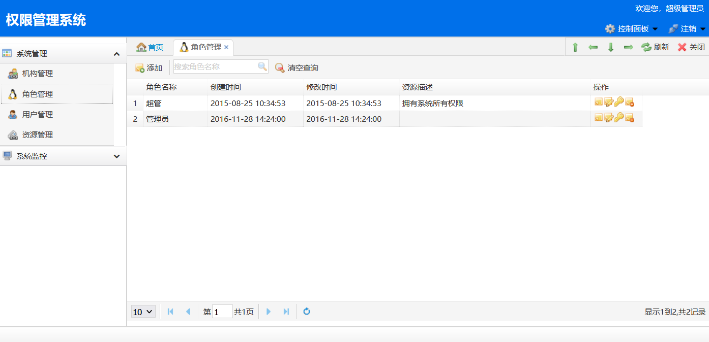
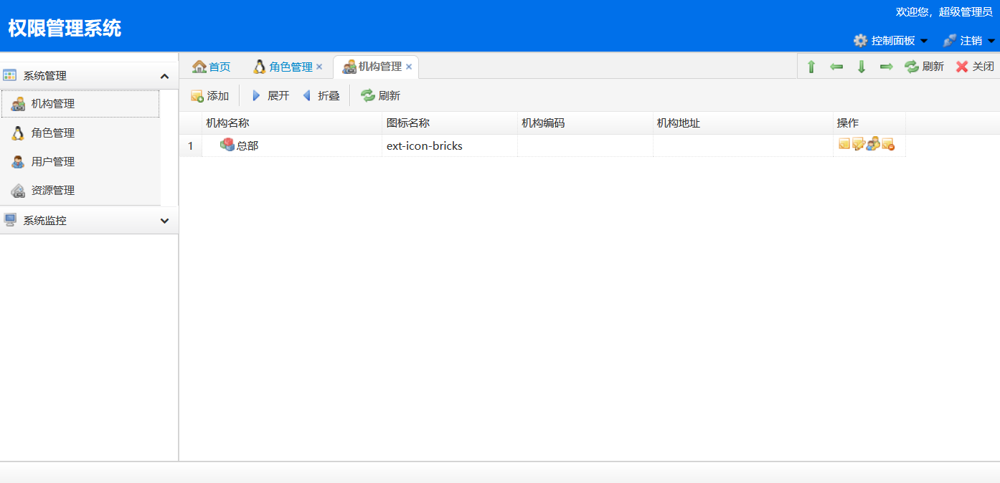
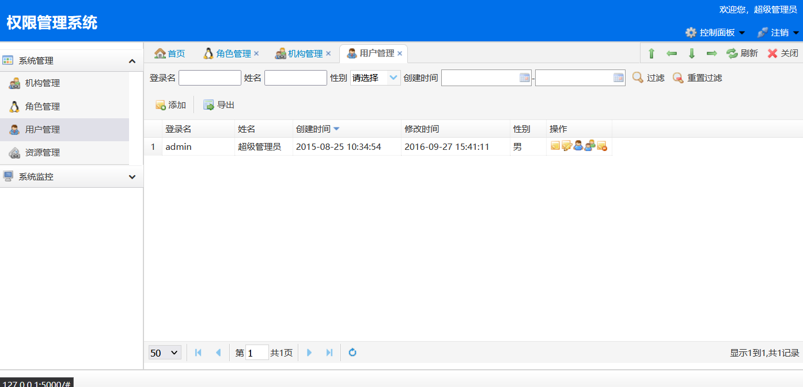
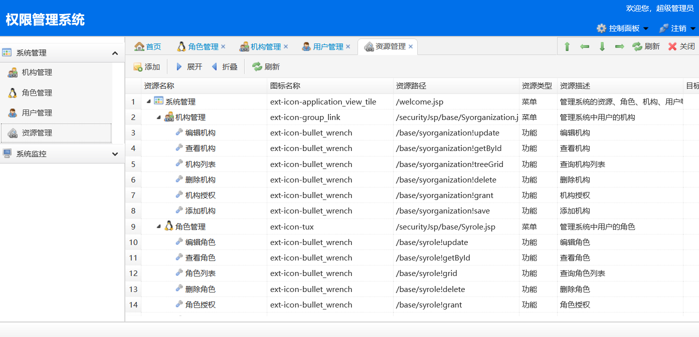
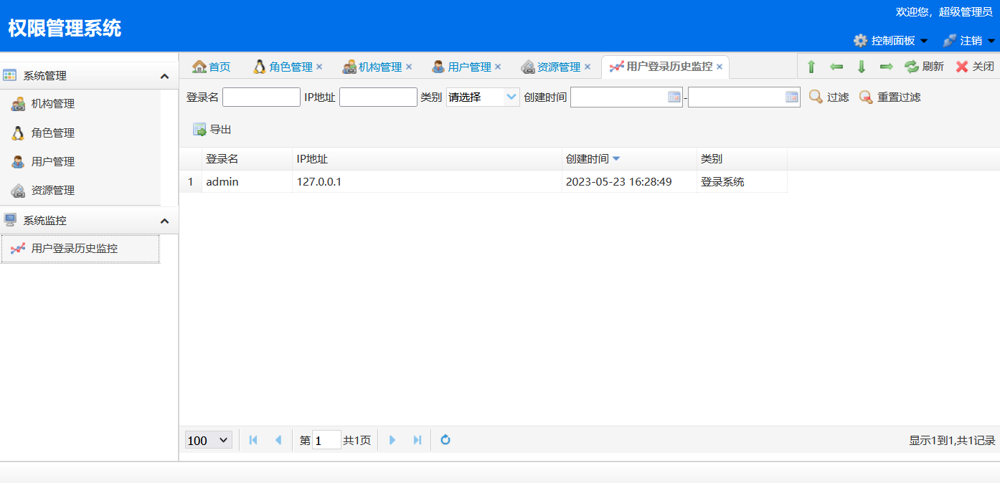
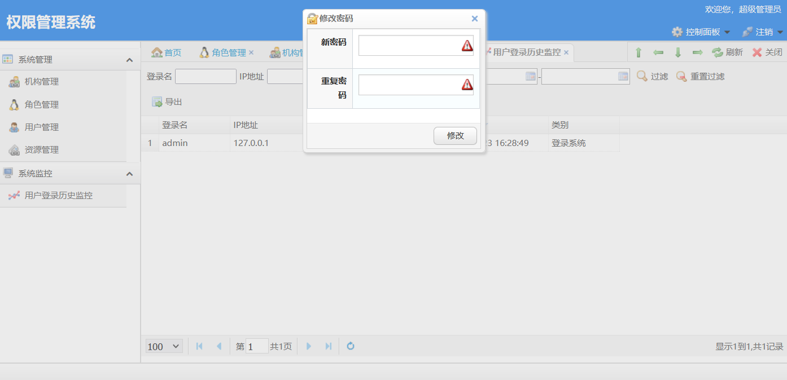
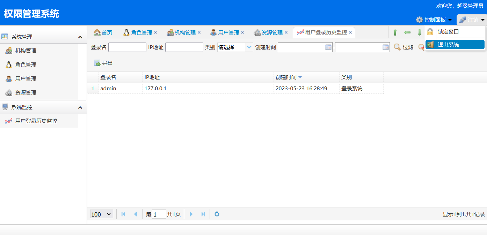
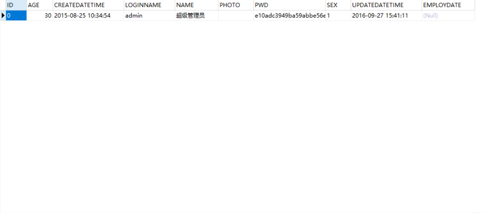

  <h1>后台权限管理系统</h1>

<a href='https://shop230447850.taobao.com/' > Taobao</a></img>
  ### **Consider contact us❤️❤️❤️!**

源码请通过底部联系方式获取 [总目录](https://gitcode.net/k54kdk/k54kdk/-/blob/master/README.md#django+mysql系统展示)

## 主体
- 主页

***

 联系方式

<html>
    

        <table align="center" >
            <tr>
                <td>
                    
                </td>
                <td>
                    
                </td>
            </tr>
        </table>
    

</html>

 联系方式

<html>
    

        <table align="center" >
            <tr>
                <td>
                    
                </td>
                <td>
                    
                </td>
            </tr>
        </table>
    

</html>
