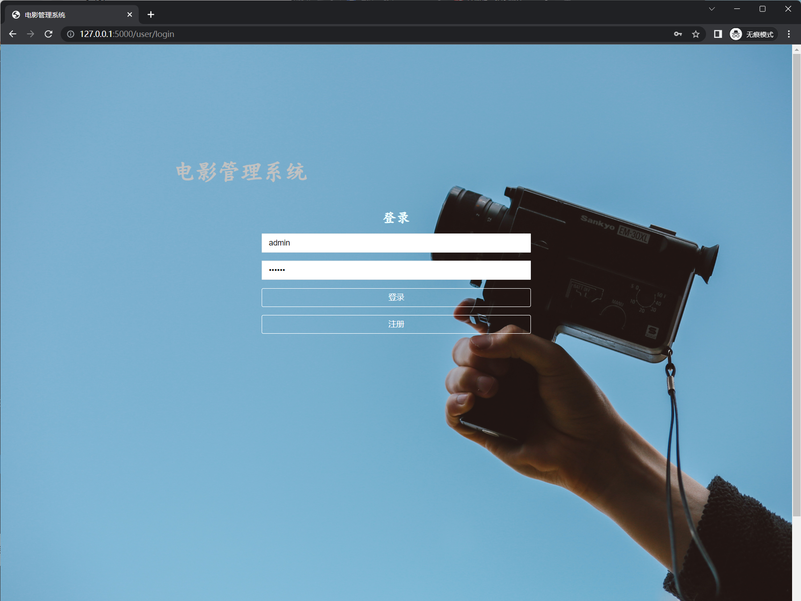
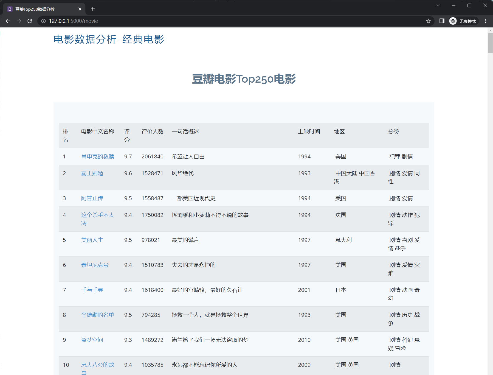
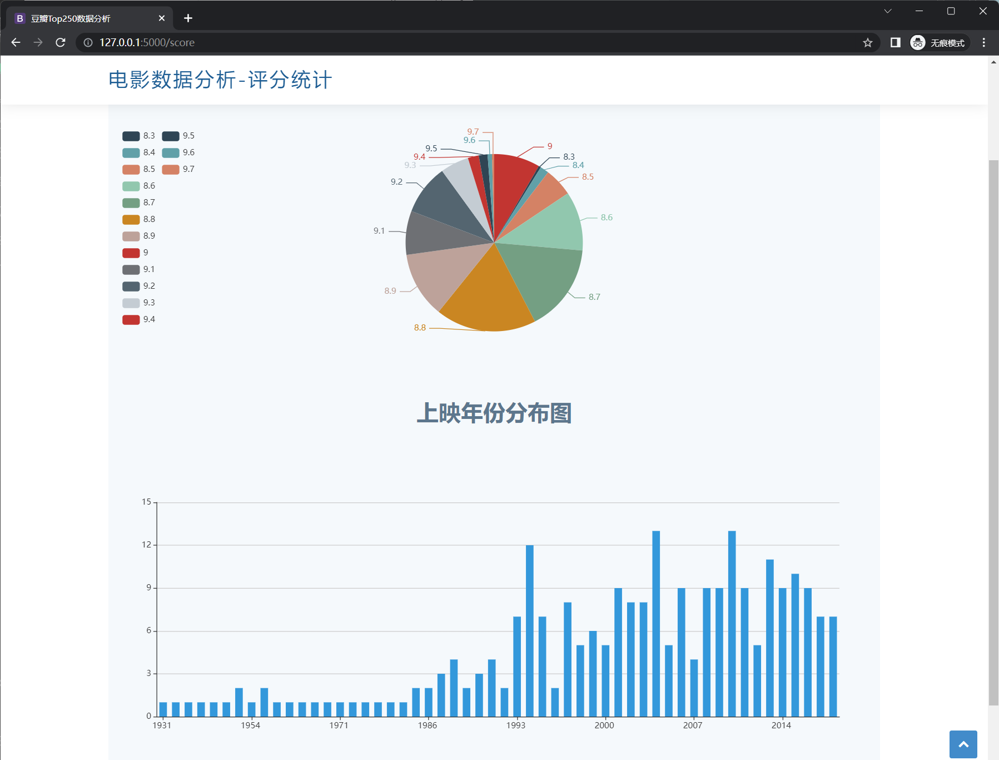
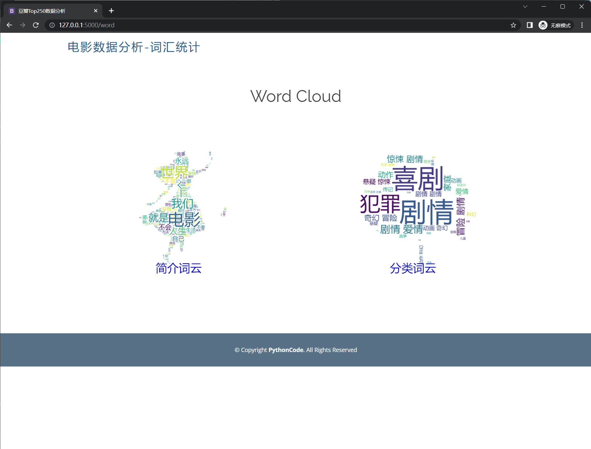
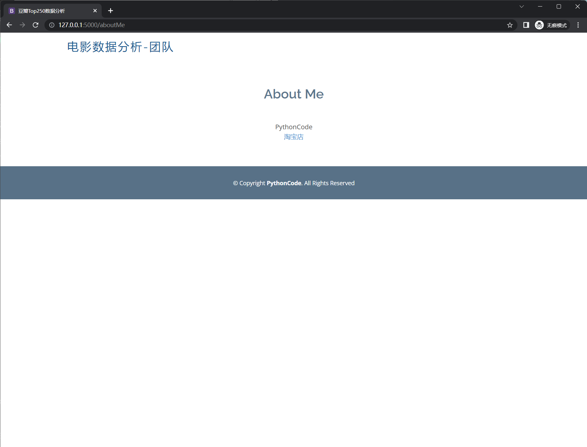

  <h1>电影管理系统</h1>

 

<a href='https://shop230447850.taobao.com/' > Taobao</a></img>
  ### **Consider contact us❤️❤️❤️!**

源码请通过公众号后台发送**电影管理系统**方式获取

## 主体

##

 联系方式

<html>
    

        <table align="center" >
            <tr>
                <td>
                    
                </td>
                <td>
                    
                </td>
                <td>
                    
                </td>
            </tr>
        </table>
    

</html>